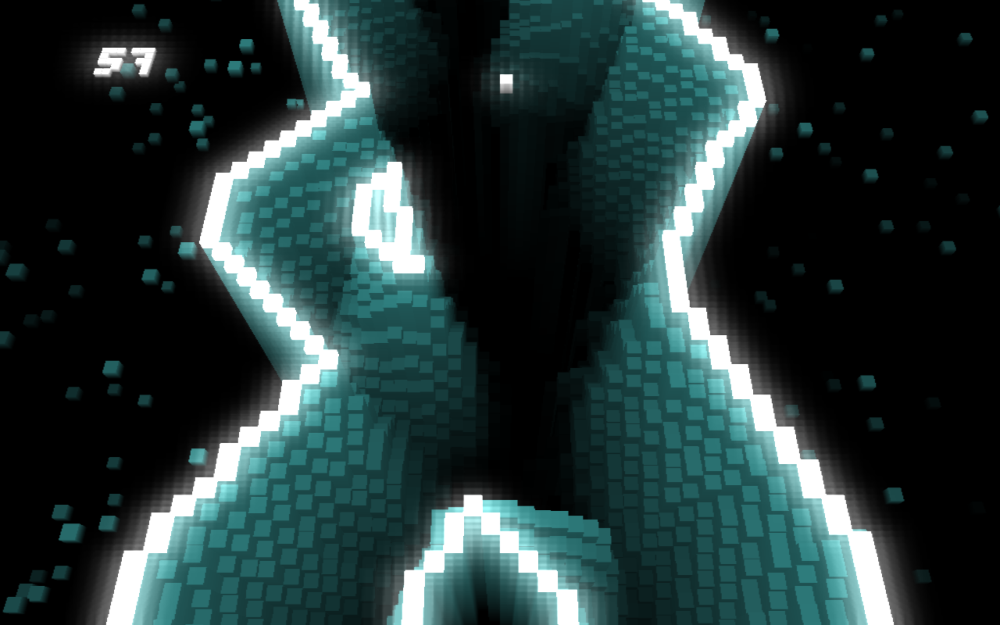

# Cortex - The psychedelic tunnel-runner

You are a thought. A thought to be born…

Guide your thought through the labyrinth of the brain, avoid hitting the walls and obstacles, nothing should distract you…

A minimalistic-ambient reflex game with a 60 frames per second flow experienceand the atmospheric music of Tamas Katai.

The code is also suitable for learning purposes.

### Files

buffers.c - Vertex buffers for different layers of the scene

bus.c - Message bus for inter-module communication

defaults.c - Settings and defaults

excavator.c - Route excavator for scene

file.c - Config file handling

floatbuffer.c - Float  collector for opengl vertex buffer

generator.c - Scene generator

levels.c - Level descriptions

main.c - SDL handling, top level event handling

maincube.c - Main cube state

menu.c - Main menu handling

ogl.c - OpenGL functions

particle.c - Particle effect generator

pixeltext.c - Pixel text renderer

renderer.c - OpenGL rendering

scene.c - Scene handling and rendering

script.c - Scene script reader

settings.c - Settings handler

voxel.c - Voxel state

### Tech info

Cortex is a pure C project written in [headerless C](https://github.com/milgra/headerlessc).  
It uses reference-counted memory management ( zc_memory.c ).  
It uses modular programming with mediator - implementation groups with different functionality that don't include each other directly, they send messages to each other.  
If a module is "static" a global variable is used to store it's state, instancing is meaningless .  

### TODO

- keyboard control in menu  
- rethink scene generation, it's hard to understand currently and flipping is visible on narrow screens