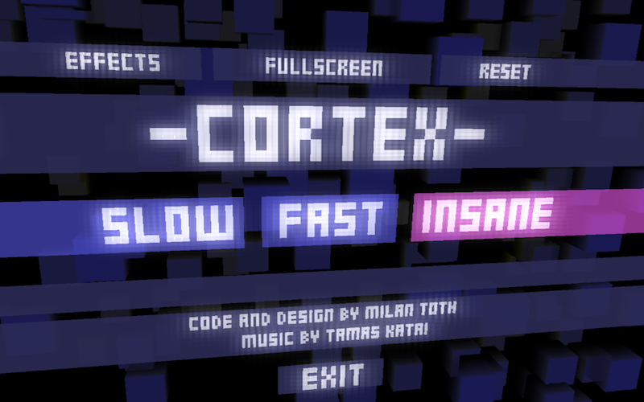

# Cortex - The psychedelic tunnel-runner

You are a thought. A thought to be born…

Guide your thought through the labyrinth of the brain, avoid hitting the walls and obstacles, nothing should distract you…

A minimalistic-ambient reflex game with a 60 frames per second flow experienceand the atmospheric music of Tamas Katai.

## Understaning the game code

The game is written in C. I got really tired of programming in the last 18 years so I went for the least code and least files possible but with maximum readability and structure. How did I achieve this?

- headerless C. Maintaining header files is a pain in the ass and so 70's. C can do it headerlessly too (https://github.com/milgra/headerlessc) 
- reference counted memory management. mtmem_alloc does the trick, mt_* types handle retain/release counting internally.
- new-line filled airy code - this forces you to write short functions that do only one thing.
- modular programming with mediator - implementation groups with different functionality don't include each other directly, they send messages to each other.
- if a module is "static" a global variable is used to store it's state, instancing is meaningless 
- no "initializer" methods if not needed, structs are defined inline and raised to the heap with a zc_mem macro

Shader trick. As you see the shader files are not valid shader files, they are C strings. That's beacuse loading shaders runtime is slow and cumbersome, I let the compiler do that with simple #includes. And they are still easy to modify this way. 

### Files

main.c - SDL handling, top level event handling

ui.c - ui handling rendering ( main module )

scene.c - scene handling and rendering ( main module )

renderer.c - rendering ( main module )

### TODO

add logging
remove leaks
test levels
add doc
keyboard control in menu